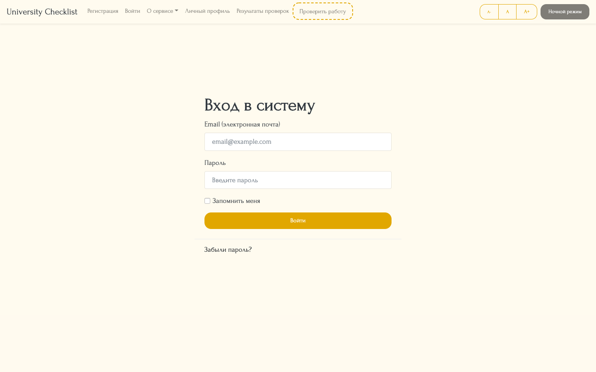
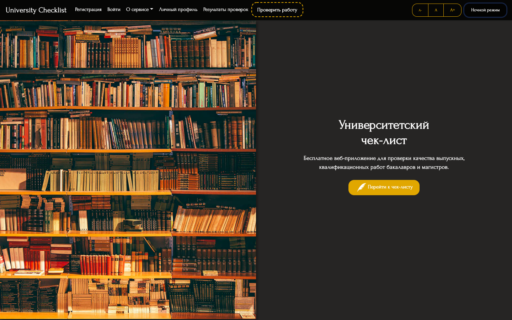
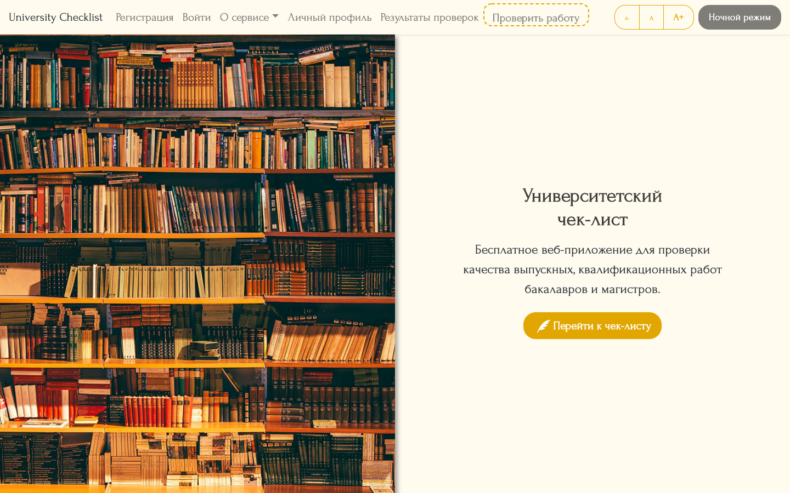
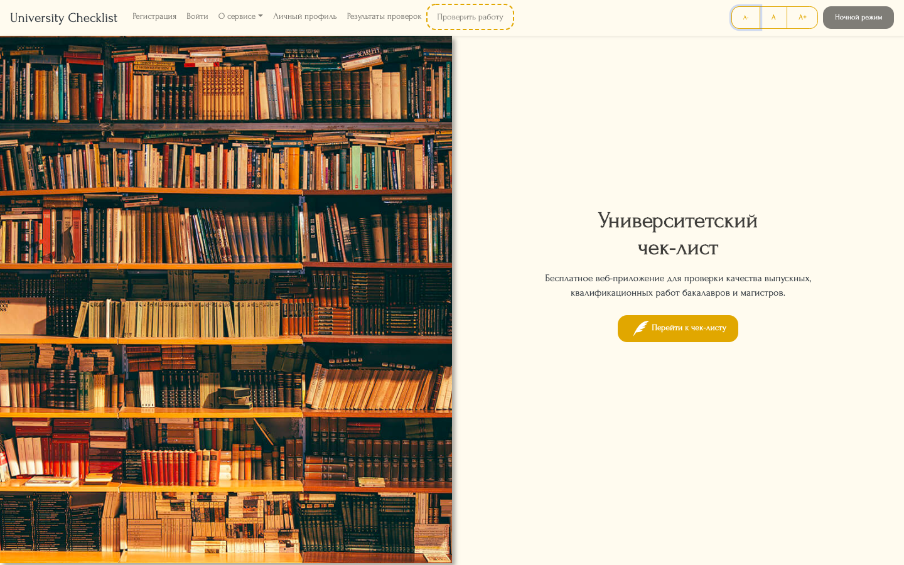
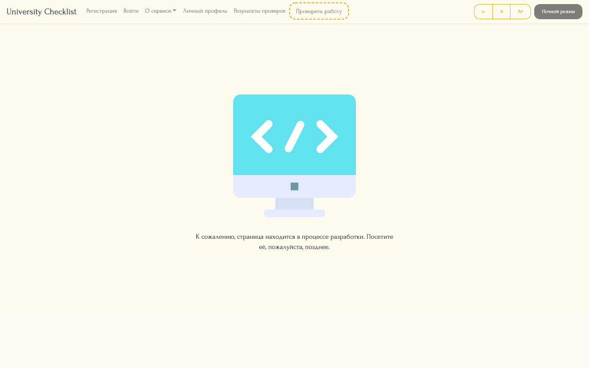

# Presentation of SPA
 

## 1. Desktop Interface

### 1.1. Home Page

### 1.2. Registration Page

### 1.3. Login Page

### 1.4. About Us

### 1.5. Checklist (Questionnaire)
")
  

## 2. App's Functionality

### 2.1. Night Mode

### 2.2. Big Font

### 2.3. Small Font

### 2.4. Development Page

### 2.5. Error Page (404)
")
