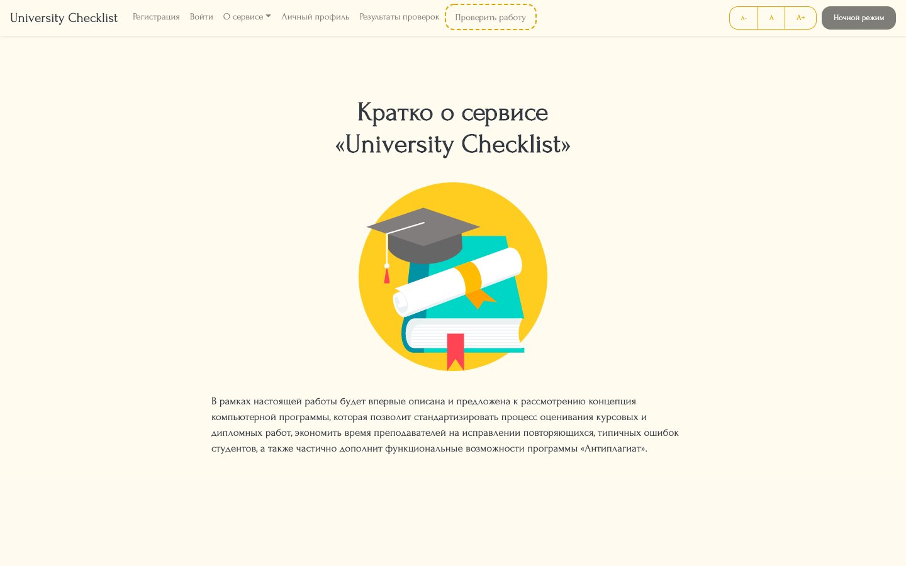

# Presentation of SPA
**«University Checklist»** is the SPA to check quality of your final, qualifying, 
university work. Technological stack: HTML, CSS, TypeScript (React.js), Bootstrap, 
jQuery, Grunt.

## Instruction to run the SPA
1. Download/clone the repository
2. Go to root directory
3. Insert following command to terminal: `npm start`
4. Open browser on link: http://localhost:3000/

## 1. Desktop Interface

### 1.1. Home Page

### 1.2. Registration Page

### 1.3. Login Page

### 1.4. About Us

### 1.5. Checklist (Questionnaire)
")
  

## 2. App's Functionality

### 2.1. Night Mode

### 2.2. Big Font

### 2.3. Small Font

### 2.4. Development Page

### 2.5. Error Page (404)
")
